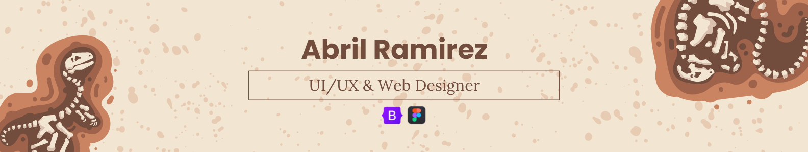

I like to learn new things about programming.
My hobbies are drawing, watching movies or playing video games.

## 🥇 My skills :
#### 🖍 Design

<h3>More Skills</h3>

  
#### ⚡ Database

  
#### 🚀 Frameworks & Library

#### 🤖 Artificial Intelligence

#### ☁ Cloud

### I am learning...

## Connect with me:
### Social media:

### 📫 Email:
You can reach me at:

## Github information:
 
